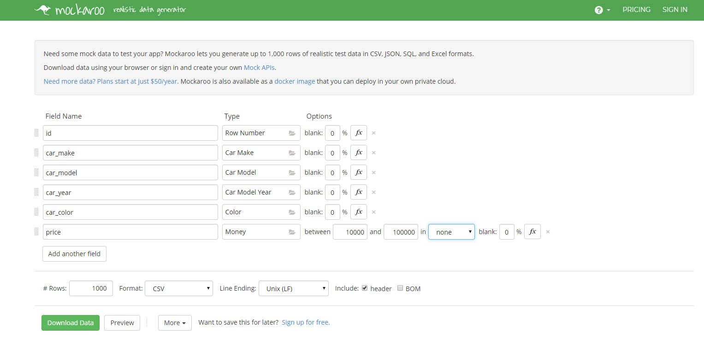
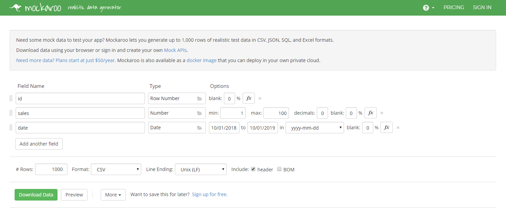

# Data-Visualization-with-Postgresql
Explored python3 and sql to create, insert, update or delete data in a table stored in a Postgresql database using Psycopg2. Data is visualized with the help of Grafana dashboards

Grafana Dashboard used display the number of sales per day from October 1st, 2018 to October 1st, 2019 (dataset from car_sales table in Postgresql)

Two datasets were used and experimented, generated from Mockaroo.com as .csv files:

<a href="https://github.com/drod1029/Data-Visualization-with-Postgresql/blob/master/cars.csv">cars.csv</a>

<a href="https://github.com/drod1029/Data-Visualization-with-Postgresql/blob/master/car_sales.csv>car_sales.csv</a>

